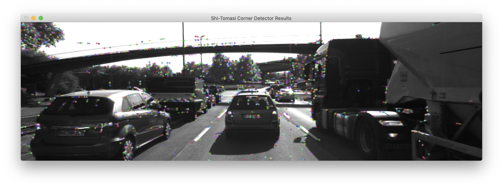
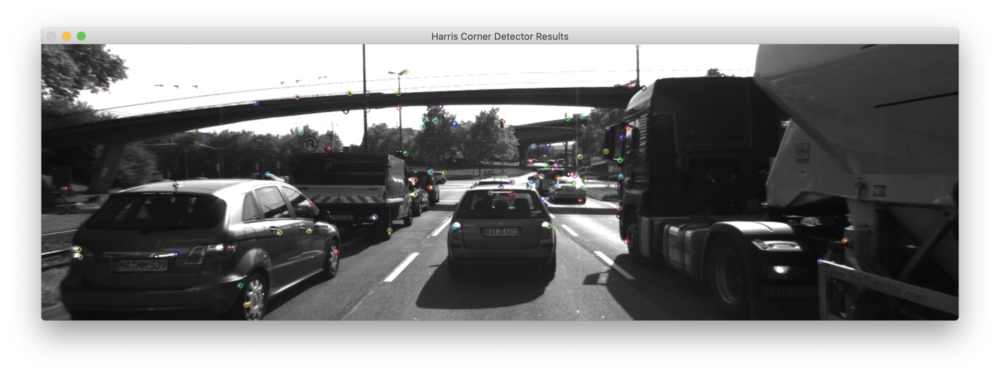
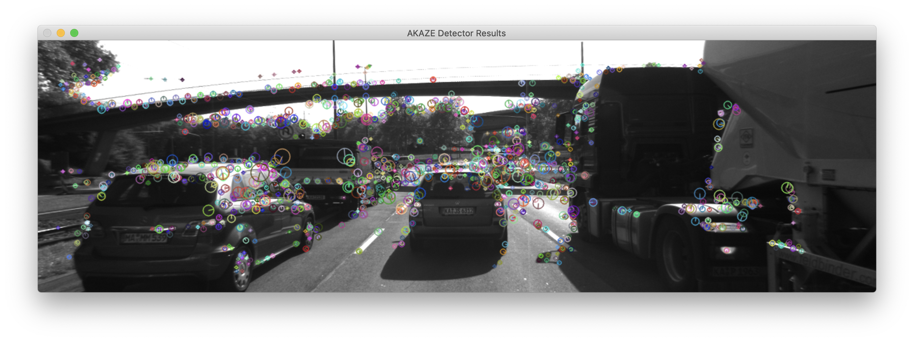
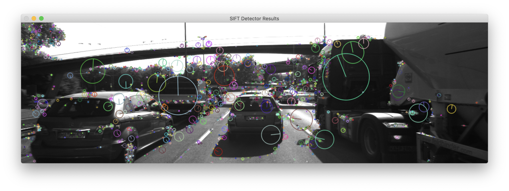

# Camera-Based 2D Feature Matching Project Writeup

This README contains the answers and how I addressed each point in the evaluation rubric as part of the submission for this project for evaluation. Please refer to each section below to review how I have answered each point in the evaluation rubric. This project concerns evaluating the different combinations of keypoint detectors and descriptors to decide what combination works best for calculating the Time-to-Collision (TTC) between the ego vehicle and the vehicle directly in front of it.

Also note that the way to run the main function has changed to accept command-line arguments as this resulted in quicker experimentation preventing constantly editing the source file and rebuilding. To run this executable, please use the following style of invocation:

```
$ ./2D_feature_tracking detectorType descriptorType matcherType selectorType bVis bLimitKpts bFocusOnVehicle
```

The command-line arguments above match the variable names in the original template of the assignment so that confusion can be avoided.

- `detectorType`: The type of detector to use - one of `SHITOMASI`, `HARRIS`, `FAST`, `BRISK`, `AKAZE`, `SIFT`
- `descriptorType`: The type of descriptor to use - one of `BRISK`, `BRIEF`, `ORB`, `FREAK`, `AKAZE`, `SIFT`
- `matcherType`: Matching algorithm - one of `MAT_BF`, `MAT_FLANN`.
- `selectorType`: Keypoint selection method - one of `SEL_NN`, `SEL_KNN`
- `bVis`: Visualising results - one of `0` (disable), `1` (enable)
- `bLimitKpts`: For limiting keypoint display results - one of `0` (disable), `1` (enable)
- `bFocusOnVehicle`: Concentrate on the preceding vehicle and remove all keypoints not within its area - one of `0` (disable), `1` (enable)

The defaults for each variable are:

- `detectorType`: `SHITOMASI`
- `descriptorType`: `BRISK`
- `matcherType`: `MAT_BF`
- `selectorType`: `SEL_NN`
- `bVis`: `1`
- `bLimitKpts`: `0`
- `bFocusOnVehicle`: `1`

You can call the executable by overriding the default variable and specify the relevant options for each above. However, they must be in the order shown above and omitting specifying the variables at the command-line will result in the defaults being used.

For example, by doing:

```
$ ./2D_feature_tracking SIFT SIFT MAT_FLANN
```

will make the detector and descriptor type SIFT using FLANN matching, but the selector type will default to `SEL_NN`, and the `bVis`, `bLimitKpts` and `bFocusOnVehicle` to be set to true, false and true respectively or `1`, `0`, `1`. Please use the command-line arguments in order to provide the appropriate grading on this project.

--------------------------------------------------------------------------------

# MP.1 - Data Buffer Optimisation

To achieve this was quite trivial. As we receive a new image, we first check to see if the buffer is at the data buffer size limit. If it is, we simply use the `std::vector::erase()` and point to the beginning of the vector as it is the "oldest" image in the buffer. We remove this entry from the vector and use `std::vector::push_back()` to place the "newest" image at the end.

# MP.2 - Keypoint Detection

The Shi-Tomasi detector method has already been provided to us as a start. In addition, the previous exercise implementing the Harris Corner Detector with the OpenCV API was used as inspiration to complete the `detKeypointsHarris` function where both the detector parameters and the non-maximum suppression implementation were implemented in this function. Lastly, the `detKeypointsModern` function was provided as a stub left for us to complete. Given the detector type which was stored in a string, the function first checks what the detector type string is, and the correct type of detector is initialised. Once that happens, the `detect()` method for the corresponding detector is called to find the keypoints in the image.

# MP.3 - Keypoint Removal

Using the `cv::Rect` that was defined to encapsulate the preceding vehicle and having the vector of keypoints that was created from MP.2, we can use `std::vector::remove_if` to create a new iterator over the keypoints such that any keypoints that were not inside this rectangle and moved towards the end of the vector where any keypoints that were indeed in the rectangle are moved towards the front. We then use `std::vector::erase()` using this new iterator to finally remove the keypoints in the vector that were outside of the rectangle. This is a very well-known operation in C++ called the [Erase-Remove Idiom](https://en.wikipedia.org/wiki/Erase%E2%80%93remove_idiom) and efficiently removes elements from a STL container that do not meet certain criteria and this was ultimately used to remove the keypoints that are not within the bounding area of the preceding vehicle.

# MP.4 - Keypoint Descriptors

This task was to finish the implementation of the `descKeypoints` function which computes the descriptors given the current frame and the keypoints detected in MP.3\. In the original template, the `BRISK` option was already implemented which constructs the right extractor to help extract descriptors from the given keypoints. We complete the implementation of this function by creating the right extractors for `ORB`, `FREAK`, `AKAZE` and `SIFT` given the `descriptorType` string. After, the extractor's `compute` method is called to extract the descriptors given the keypoints from MP.3.

# MP.5 - Descriptor Matching

In the `matchDescriptors` function, the objective is to match descriptors between two images so that the corresponding keypoints match visually. The brute-force approach has already been provided. Take note that the cross check option has been enabled and the distance type is now dynamically set for the brute-force approach such that it is the L2 norm when using `SIFT` and the Hamming distance for the other descriptors as they're binary.

To implement the FLANN-based method, this was simply taken from previous exercises. The workaround mentioned in the video lectures is to convert the descriptors into floating-point type before using the matching methods from OpenCV to match descriptors. Between both brute-force and FLANN-based approaches, the right matcher is created for the appropriate scenario.

# MP.6 - Descriptor Distance Ratio

Within `matchDescriptors`, the nearest neighbour matching task has already been implemented which uses the brute-force to return the best match for each descriptor provided from the previous frame. It is here where this next task is implemented where we provide the k-nearest neighbour matching method where `k = 2`. This section to implement was also taken from previous exercises such that for each keypoint in the previous frame, we return two possible matches. The distance ratio logic was implemented such that if the ratio between the distance of the first match to the second match is less than a certain threshold (0.8 in this case), the match is not ambiguous with other possibly repeating patterns or textures in the image. Therefore, should we get a match lower than the threshold, then we place the keypoint from the previous frame and this matched keypoint for the current frame in the vector of matches to be used for later.

# MP.7 - Performance Evaluation 1

The objective here is to count the number of keypoints for each method over all 10 images provided in this midterm project. We should also take note of the distribution of the neighbourhood size (i.e. the scale) and that the number of keypoints is solely restricted to the preceding vehicle.

We show this in the following table below:

|  Detector  | Img 1 Count | Img 2 Count | Img 3 Count | Img 4 Count | Img 5 Count | Img 6 Count | Img 7 Count | Img 8 Count | Img 9 Count | Img 10 Count |
|:----------:|:-----------:|:-----------:|:-----------:|:-----------:|:-----------:|:-----------:|:-----------:|:-----------:|:-----------:|:------------:|
| Shi-Tomasi |     125     |     118     |     123     |     120     |     120     |     113     |     114     |     123     |     111     |     112      |
|   Harris   |     15      |     13      |     16      |     14      |     21      |     32      |     14      |     27      |     21      |      23      |
|    FAST    |     149     |     152     |     150     |     155     |     149     |     149     |     156     |     150     |     138     |     143      |
|   BRISK    |     264     |     282     |     282     |     277     |     297     |     279     |     289     |     272     |     266     |     254      |
|    ORB     |     92      |     102     |     106     |     113     |     109     |     125     |     130     |     129     |     127     |     128      |
|   AKAZE    |     166     |     157     |     161     |     155     |     163     |     164     |     173     |     175     |     177     |     179      |
|    SIFT    |     138     |     132     |     124     |     137     |     134     |     140     |     137     |     148     |     159     |     137      |

As for the neighbourhood size, the Shi-Tomasi algorithm had a good amount of keypoints spread around the image. The Harris detector was quite sparse where there were very few keypoints detected and it looked like that they were only visible in very strong corners in the image. The neighbourhood size for the aforementioned is not applicable as it is not a multiscale detector.

The Shi-Tomasi and Harris detectors are just feature point detectors, so they are agnostic to the scale / neighbourhood size of the window. However, you do need to set the aperture size of the detectors before hand so they in fact all share the same "scale" of detection. The Shi-Tomasi results do have a good spread around the image.



However, the Harris corner detector results are quite sparse, most likely due to the parameters being set for the non-maximum suppression.



The FAST detector seems to be attracted to the bridge and trees more rather than the preceding vehicle, but keypoints on the other vehicles were captured. This could be mitigated by tweaking the default parameters.


The BRISK detector had a good spread of keypoints of various sizes around the image but they looked rather noisy, not to mention that there were many more keypoints detected than the previous two methods and were quite large.


The ORB method produced keypoints that were spread out mostly on the road areas and vehicles and less around the bridges and trees. The scale / neighbourhood sizes for the ORB detector were mostly the same and were quite large.


The AKAZE detector had a good spread of keypoints like BRISK but the neighbourhood sizes were smaller, meaning that the representative power of the descriptor is more compact.



For the SIFT detector, this has a similar spread of keypoints like BRISK and AKAZE but the neighbourhood sizes were well distributed as one would expect.



# MP.8 - Performance Evaluation 2

In this task, we will count the number of matches between all possible pairs of detectors and descriptors. Please note that there are 7 detectors and 6 descriptors we can use here 7 x 6 = 42 combinations. The table below illustrates the number of matches for every combination where the rows indicate the detector and the columns indicate the descriptor. Each entry in the table is a comma-separated list denoting the number of matches found in order from frame 0 to frame 1, frame 1 to frame 2 up until to frame 8 to frame 9.

**Note:** It is not possible to use AKAZE descriptors with any other keypoints. You can **only** use AKAZE descriptors with AKAZE keypoints due the AKAZE using the `class_id` attribute in the `cv::KeyPoint` class with the other descriptors setting this attribute to -1\. Using other keypoints with the AKAZE descriptors throws an exception: <https://github.com/kyamagu/mexopencv/issues/351#issuecomment-319528154>. Therefore, evaluations with AKAZE as the descriptor are not applicable and are reflected in the table accordingly.

**Note #2:** The instructions regarding using brute force matching combined with the distance ratio test of 0.8 do not make sense. The distance ratio test only applies to KNN matching where you need to generate two keypoint matches per keypoint from the reference image. Because brute force matching only generates the closest match (i.e. K = 1) instead of the two closest matches (i.e. K = 2), the ratio test is not applicable. I have made the assumption to use KNN (i.e. FLANN) matching instead with K = 2 to enforce the ratio test.

**Note #3:** As noted on the Udacity forums: <https://knowledge.udacity.com/questions/105392>, combining the SIFT detector with the ORB descriptor has known bugs so this combination is skipped in the evaluation

| Detector (row) / Descriptor (column) |                    BRISK                     |                    BRIEF                     |                 ORB                 |                FREAK                |                AKAZE                |                     SIFT                     |
|:------------------------------------:|:--------------------------------------------:|:--------------------------------------------:|:-----------------------------------:|:-----------------------------------:|:-----------------------------------:|:--------------------------------------------:|
|            **SHITOMASI**             |     558,549,543,534,554,525,530,561,558      |     745,733,736,745,742,719,716,739,750      | 656,608,643,641,617,580,611,626,631 | 476,467,470,451,439,445,407,464,414 |                 N/A                 | 1055,1053,1068,1055,1028,1040,1045,1078,1062 |
|              **HARRIS**              |          47,46,43,53,79,49,43,79,79          |          60,62,62,68,88,71,49,95,96          |     54,51,51,60,87,72,42,86,81      |     40,35,36,44,57,49,31,70,64      |                 N/A                 |        77,71,76,82,122,83,64,117,120         |
|               **FAST**               |     765,758,784,716,762,734,688,704,698      |     951,993,979,950,962,921,923,921,932      | 888,862,892,831,874,861,818,786,825 | 589,594,614,583,593,580,523,597,582 |                 N/A                 | 1420,1431,1397,1372,1369,1390,1395,1351,1353 |
|              **BRISK**               | 1090,1107,1124,1068,1076,1059,1024,1012,1003 | 1229,1366,1280,1289,1264,1218,1277,1290,1213 | 802,786,827,741,777,763,727,765,711 | 874,918,913,841,891,849,853,869,816 |                 N/A                 | 740,1748,1726,1682,1745,1650,1714,1638,1636  |
|               **ORB**                |     261,260,265,270,276,284,275,267,272      |     179,196,203,211,203,217,189,198,209      | 211,226,227,216,217,229,221,215,223 |  93,95,101,107,97,106,111,106,105   |                 N/A                 |     371,372,374,364,367,374,383,378,371      |
|              **AKAZE**               |                     N/A                      |                     N/A                      |                 N/A                 |                 N/A                 | 891,886,895,879,909,915,861,918,883 |                     N/A                      |
|               **SIFT**               |     488,487,488,466,482,476,454,486,478      |     537,492,516,504,502,496,511,477,530      |                 N/A                 | 416,370,360,348,360,337,382,333,378 |                 N/A                 |     810,792,762,760,766,749,755,827,821      |

# MP.9 - Performance Evaluation 3

In this task, we will measure the amount of time taken to calculate the detected keypoints and the resulting descriptors. To get a better sense of timing, we will report the **average** time it takes to compute the detector and descriptor over all 10 frames. This is shown in the table below, but also provided as a spreadsheet due to the requirements of this part of the rubric. This is in the same style of formatting as the previous table. There will be two numbers reported where the first number is for the detector and the second number is for the descriptor.

**Note:** The source was compiled in Release mode to get an accurate sense of how well this can perform when deployed to production.

| Detector (row) / Descriptor (column) |          BRISK          |          BRIEF          |          ORB           |          FREAK          |         AKAZE         |          SIFT           |
|:------------------------------------:|:-----------------------:|:-----------------------:|:----------------------:|:-----------------------:|:---------------------:|:-----------------------:|
|            **SHITOMASI**             | 11.2417 ms, 9.61678 ms  | 11.0443 ms, 2.50537 ms  | 10.8732 ms, 3.02162 ms |  10.584 ms, 23.8821 ms  |          N/A          | 10.6742 ms, 12.7876 ms  |
|              **HARRIS**              | 126.485 ms, 1.75835 ms  | 118.073 ms, 0.777383 ms | 120.69 ms, 1.76558 ms  |  123.84 ms, 16.3915 ms  |          N/A          | 125.106 ms, 10.8813 ms  |
|               **FAST**               | 0.632346 ms, 12.5671 ms | 0.623129 ms, 3.27537 ms | 0.606129 ms, 3.5756 ms | 0.618449 ms, 25.3418 ms |          N/A          | 0.630753 ms, 22.0335 ms |
|              **BRISK**               | 28.1463 ms, 19.8018 ms  | 28.7253 ms, 4.10031 ms  | 29.6302 ms, 9.82752 ms | 30.5165 ms, 27.2383 ms  |          N/A          | 27.6543 ms, 54.7457 ms  |
|               **ORB**                |  9.39289 ms, 4.0389 ms  | 7.84851 ms, 1.50553 ms  | 7.41869 ms, 7.43067 ms | 7.59836 ms, 19.0572 ms  |          N/A          | 7.86322 ms, 42.9125 ms  |
|              **AKAZE**               |           N/A           |           N/A           |          N/A           |           N/A           | 49.104 ms, 44.8174 ms |           N/A           |
|               **SIFT**               | 75.0165 ms, 10.7624 ms  | 71.8705 ms, 2.92387 ms  |          N/A           | 71.4849 ms, 24.5969 ms  |          N/A          |   75.0969 ms, 57.2189   |

Looking at the timing results alone shows that the FAST detector method is the leading one that can compute keypoints very quickly. By also consulting MP.7 and MP.8, there is a good spread around where the preceding vehicle is and comparable matches to the rest of the algorithms. Therefore, for computational efficiency and leveraging the amount of keypoints that are detected within the area of the preceding vehicle, the top three choices based on ranking by time are:

1. Detector: FAST, Descriptor: BRIEF
2. Detector: FAST, Descriptor: ORB
3. Detector: ORB, Descriptor: BRIEF

It seems that BRIEF all around is a fast descriptor to compute where FAST is a good algorithm for fast detection of keypoints.
